<!-- README.md is generated from README.Rmd. Please edit that file -->

# COVID19analytics

<!-- . -->

This package curate (downloads, clean, consolidate, smooth) [data from
Johns Hokpins](https://github.com/CSSEGISandData/COVID-19/) for
analysing international outbreak of COVID-19.

It includes several visualizations of the COVID-19 international
outbreak.

Yanchang Zhao, COVID-19 Data Analysis with Tidyverse and Ggplot2 -
China. RDataMining.com, 2020.

URL:
<http://www.rdatamining.com/docs/Coronavirus-data-analysis-china.pdf>.

- COVID19DataProcessor generates curated series
- [visualizations](https://www.r-bloggers.com/coronavirus-data-analysis-with-r-tidyverse-and-ggplot2/)
  by [Yanchang Zhao](https://www.r-bloggers.com/author/yanchang-zhao/)
  are included in ReportGenerator R6 object
- More visualizations included int ReportGeneratorEnhanced R6 object
- Visualizations ReportGeneratorDataComparison compares all countries
  counting epidemy day 0 when confirmed cases \> n (i.e. n = 100).

# Consideration

Data is still noisy because there are missing data from some regions in
some days. We are working on in it.

# Package

<!-- badges: start -->

| Release                                                                                                              | Usage                                                                                                    | Development                                                                                                                                                                                            |
|:---------------------------------------------------------------------------------------------------------------------|:---------------------------------------------------------------------------------------------------------|:-------------------------------------------------------------------------------------------------------------------------------------------------------------------------------------------------------|
|                                                                                                                      | [](https://cran.r-project.org/) | [](https://travis-ci.org/rOpenStats/COVID19analytics)                                                                    |
| [](https://cran.r-project.org/package=COVID19analytics) |                                                                                                          | [](https://codecov.io/gh/rOpenStats/COVID19analytics)                                                       |
|                                                                                                                      |                                                                                                          | [](https://www.repostatus.org/#active) |

<!-- badges: end -->

# How to get started (Development version)

Install the R package using the following commands on the R console:

``` r
# install.packages("devtools")
devtools::install_github("rOpenStats/COVID19analytics", build_opts = NULL)
```

# How to use it

``` r
library(COVID19analytics) 
#> Warning: replacing previous import 'ggplot2::Layout' by 'lgr::Layout' when
#> loading 'COVID19analytics'
#> Warning: replacing previous import 'readr::col_factor' by 'scales::col_factor'
#> when loading 'COVID19analytics'
#> Warning: replacing previous import 'magrittr::not' by 'testthat::not' when
#> loading 'COVID19analytics'
#> Warning: replacing previous import 'dplyr::matches' by 'testthat::matches' when
#> loading 'COVID19analytics'
#> Warning: replacing previous import 'readr::edition_get' by
#> 'testthat::edition_get' when loading 'COVID19analytics'
#> Warning: replacing previous import 'magrittr::equals' by 'testthat::equals' when
#> loading 'COVID19analytics'
#> Warning: replacing previous import 'magrittr::is_less_than' by
#> 'testthat::is_less_than' when loading 'COVID19analytics'
#> Warning: replacing previous import 'readr::local_edition' by
#> 'testthat::local_edition' when loading 'COVID19analytics'
#> Warning: replacing previous import 'testthat::matches' by 'tidyr::matches' when
#> loading 'COVID19analytics'
#> Warning: replacing previous import 'magrittr::extract' by 'tidyr::extract' when
#> loading 'COVID19analytics'
library(dplyr) 
#> 
#> Attaching package: 'dplyr'
#> The following objects are masked from 'package:stats':
#> 
#>     filter, lag
#> The following objects are masked from 'package:base':
#> 
#>     intersect, setdiff, setequal, union
```

``` r
data.processor <- COVID19DataProcessor$new(provider = "JohnsHopkingsUniversity", missing.values = "imputation")

#dummy <- data.processor$preprocess() is setupData + transform is the preprocess made by data provider
dummy <- data.processor$setupData()
#> INFO  [11:30:08.712]  {stage: `processor-setup`}
#> INFO  [11:30:08.920] Checking required downloaded  {downloaded.max.date: `2023-01-05`, daily.update.time: `21:00:00`, current.datetime: `2023-01-08 11:30:08`, download.flag: `TRUE`}
#> INFO  [11:30:10.747] Checking required downloaded  {downloaded.max.date: `2023-01-05`, daily.update.time: `21:00:00`, current.datetime: `2023-01-08 11:30:10`, download.flag: `TRUE`}
#> INFO  [11:30:12.257] Checking required downloaded  {downloaded.max.date: `2023-01-05`, daily.update.time: `21:00:00`, current.datetime: `2023-01-08 11:30:12`, download.flag: `TRUE`}
#> INFO  [11:30:14.157]  {stage: `data loaded`}
#> INFO  [11:30:14.159]  {stage: `data-setup`}
dummy <- data.processor$transform()
#> INFO  [11:30:14.161] Executing transform
#> INFO  [11:30:14.162] Executing consolidate
#> INFO  [11:30:49.712]  {stage: `consolidated`}
#> INFO  [11:30:49.713] Executing standarize
#> INFO  [11:30:54.035] gathering DataModel
#> INFO  [11:30:54.036]  {stage: `datamodel-setup`}
# Curate is the process made by missing values method
dummy <- data.processor$curate()
#> INFO  [11:30:54.049]  {stage: `loading-aggregated-data-model`}
#> Warning in countrycode_convert(sourcevar = sourcevar, origin = origin, destination = dest, : Some values were not matched unambiguously: Antarctica
#> Warning in countrycode_convert(sourcevar = sourcevar, origin = origin, destination = dest, : Some values were not matched unambiguously: Micronesia
#> Warning in countrycode_convert(sourcevar = sourcevar, origin = origin, destination = dest, : Some values were not matched unambiguously: MS Zaandam
#> Warning in countrycode_convert(sourcevar = sourcevar, origin = origin, destination = dest, : Some values were not matched unambiguously: Summer Olympics 2020
#> Warning in countrycode_convert(sourcevar = sourcevar, origin = origin, destination = dest, : Some values were not matched unambiguously: Winter Olympics 2022
#> INFO  [11:30:58.889]  {stage: `calculating-rates`}
#> INFO  [11:30:59.240]  {stage: `making-data-comparison`}
#> INFO  [11:31:14.377]  {stage: `applying-missing-values-method`}
#> INFO  [11:31:14.379]  {stage: `Starting first imputation`}
#> INFO  [11:31:14.403]  {stage: `calculating-rates`}
#> INFO  [11:31:14.940]  {stage: `making-data-comparison-2`}
#> INFO  [11:31:30.246]  {stage: `calculating-top-countries`}
#> INFO  [11:31:30.279]  {stage: `curated`}

current.date <- max(data.processor$getData()$date)

rg <- ReportGeneratorEnhanced$new(data.processor)
rc <- ReportGeneratorDataComparison$new(data.processor = data.processor)


top.countries <- data.processor$top.countries
international.countries <- unique(c(data.processor$top.countries,
                                    "China", "Japan", "Singapore", "Korea, South"))
africa.countries <- sort(data.processor$countries$getCountries(division = "continent", name = "Africa"))
```

``` r
# Top 10 daily cases confirmed increment
(data.processor$getData() %>%
  filter(date == current.date) %>%
  select(country, date, rate.inc.daily, confirmed.inc, confirmed, deaths, deaths.inc) %>%
  arrange(desc(confirmed.inc)) %>%
  filter(confirmed >=10))[1:10,]
#> # A tibble: 10 × 7
#> # Groups:   country [10]
#>    country      date       rate.inc.daily confirmed.inc confirmed deaths death…¹
#>    <chr>        <date>              <dbl>         <int>     <int>  <int>   <int>
#>  1 Japan        2023-01-07         0.0079        238654  30305173 5.94e4     463
#>  2 Korea, South 2023-01-07         0.0016         46766  29520600 3.26e4      34
#>  3 Taiwan*      2023-01-07         0.0027         24410   9031781 1.55e4      61
#>  4 China        2023-01-07         0.0034         15850   4655269 1.75e4      72
#>  5 US           2023-01-07         0               4644 101239724 1.10e6      14
#>  6 Chile        2023-01-07         0.0009          4419   5062734 6.33e4      30
#>  7 Russia       2023-01-07         0.0002          3284  21515655 3.86e5      48
#>  8 Austria      2023-01-07         0.0003          1641   5724215 2.15e4       2
#>  9 Guatemala    2023-01-07         0.0013          1527   1211008 2.00e4       7
#> 10 Slovenia     2023-01-07         0.0006           835   1313501 7.02e3       2
#> # … with abbreviated variable name ¹​deaths.inc
```

``` r
# Top 10 daily deaths increment
(data.processor$getData() %>%
  filter(date == current.date) %>%
  select(country, date, rate.inc.daily, confirmed.inc, confirmed, deaths, deaths.inc) %>%
  arrange(desc(deaths.inc)))[1:10,]
#> # A tibble: 10 × 7
#> # Groups:   country [10]
#>    country      date       rate.inc.daily confirmed.inc confirmed deaths death…¹
#>    <chr>        <date>              <dbl>         <int>     <int>  <int>   <int>
#>  1 Japan        2023-01-07         0.0079        238654  30305173 5.94e4     463
#>  2 China        2023-01-07         0.0034         15850   4655269 1.75e4      72
#>  3 Taiwan*      2023-01-07         0.0027         24410   9031781 1.55e4      61
#>  4 Russia       2023-01-07         0.0002          3284  21515655 3.86e5      48
#>  5 Korea, South 2023-01-07         0.0016         46766  29520600 3.26e4      34
#>  6 Chile        2023-01-07         0.0009          4419   5062734 6.33e4      30
#>  7 US           2023-01-07         0               4644 101239724 1.10e6      14
#>  8 Czechia      2023-01-07         0.0001           375   4582860 4.22e4      10
#>  9 Philippines  2023-01-07         0.0002           643   4067170 6.55e4      10
#> 10 Croatia      2023-01-07         0                 46   1265333 1.77e4       9
#> # … with abbreviated variable name ¹​deaths.inc
```

``` r
rg$ggplotTopCountriesStackedBarDailyInc(included.countries = africa.countries,
                                                  countries.text = "Africa")
#> Warning: Removed 318 rows containing missing values (`position_stack()`).
```

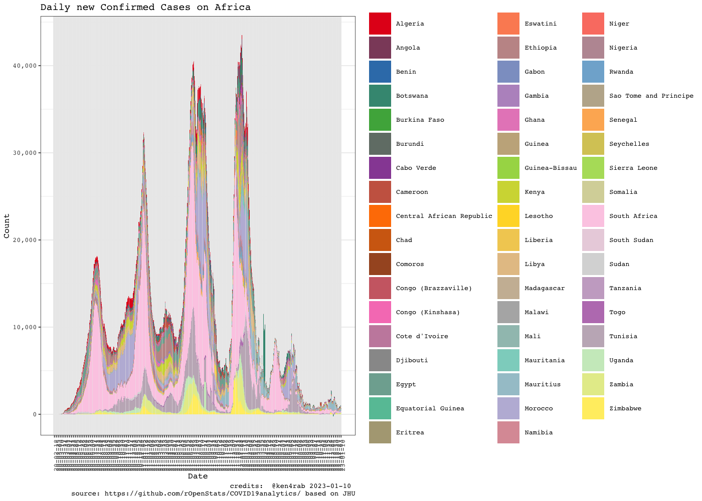

``` r
rc$ggplotComparisonExponentialGrowth(included.countries = africa.countries, min.cases = 20)
#> Warning: ggrepel: 41 unlabeled data points (too many overlaps). Consider
#> increasing max.overlaps
```

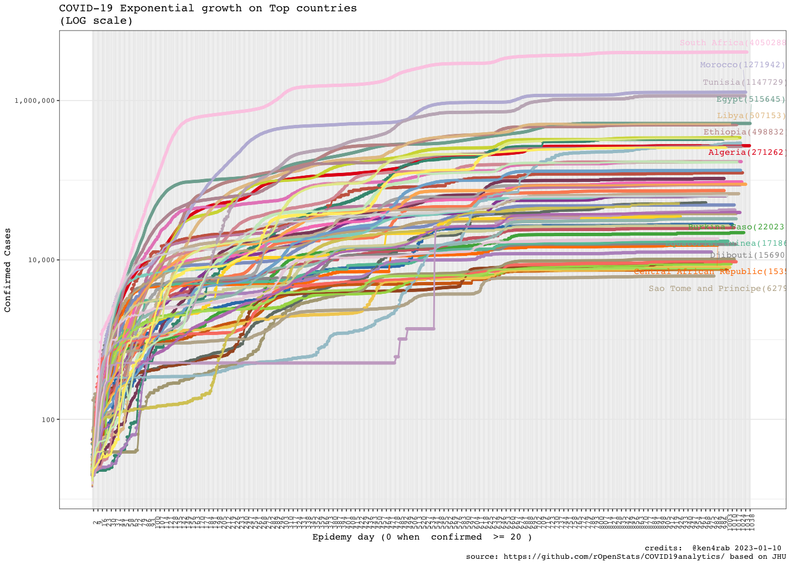

``` r

rg$ggplotCountriesLines(included.countries = africa.countries, countries.text = "Africa countries",
                        field = "confirmed.inc", log.scale = TRUE)
#> Warning: Removed 318 rows containing missing values (`geom_line()`).
#> Warning: ggrepel: 21 unlabeled data points (too many overlaps). Consider
#> increasing max.overlaps
```

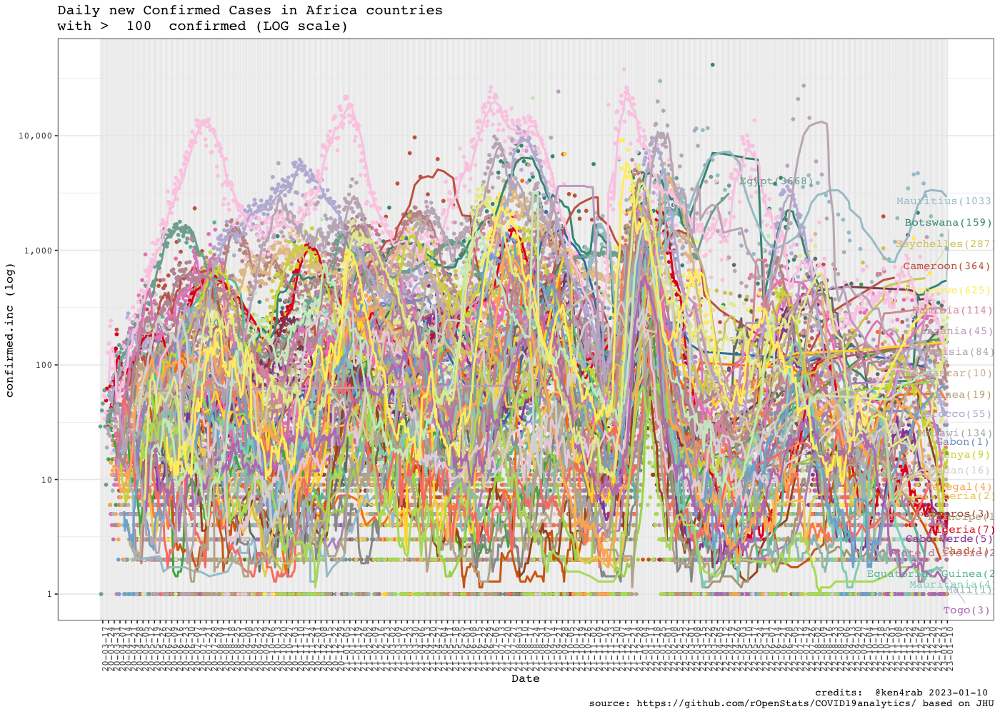

``` r
rc$ggplotComparisonExponentialGrowth(included.countries = africa.countries, 
                                     field = "deaths", y.label = "deaths", min.cases = 1)
#> Warning: ggrepel: 37 unlabeled data points (too many overlaps). Consider
#> increasing max.overlaps
```

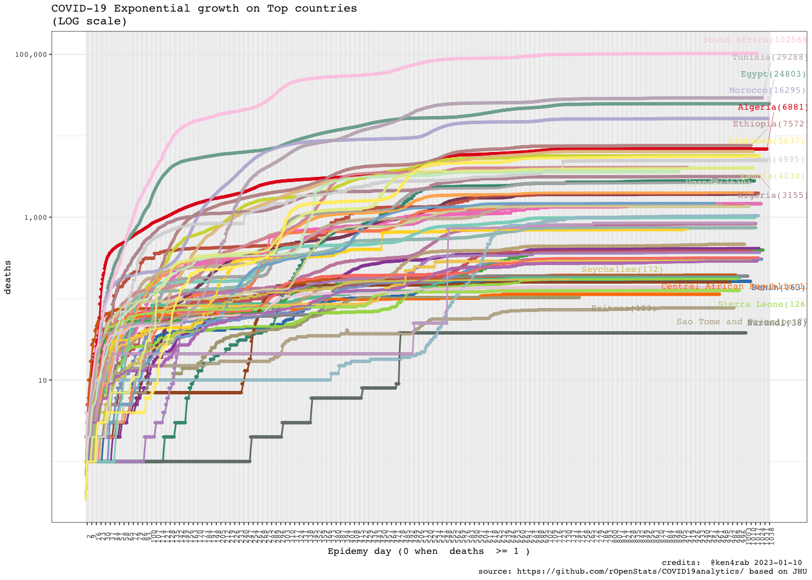

``` r
rg$ggplotTopCountriesStackedBarDailyInc(top.countries)
#> Warning: Removed 69 rows containing missing values (`position_stack()`).
```

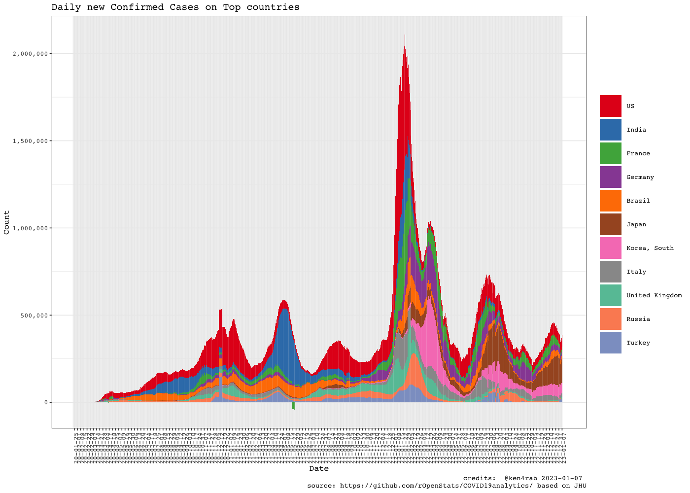

``` r
rc$ggplotComparisonExponentialGrowth(included.countries = international.countries, 
                                               min.cases = 100)
#> Warning: Removed 2 rows containing missing values (`geom_line()`).
#> Warning: ggrepel: 3 unlabeled data points (too many overlaps). Consider
#> increasing max.overlaps
```

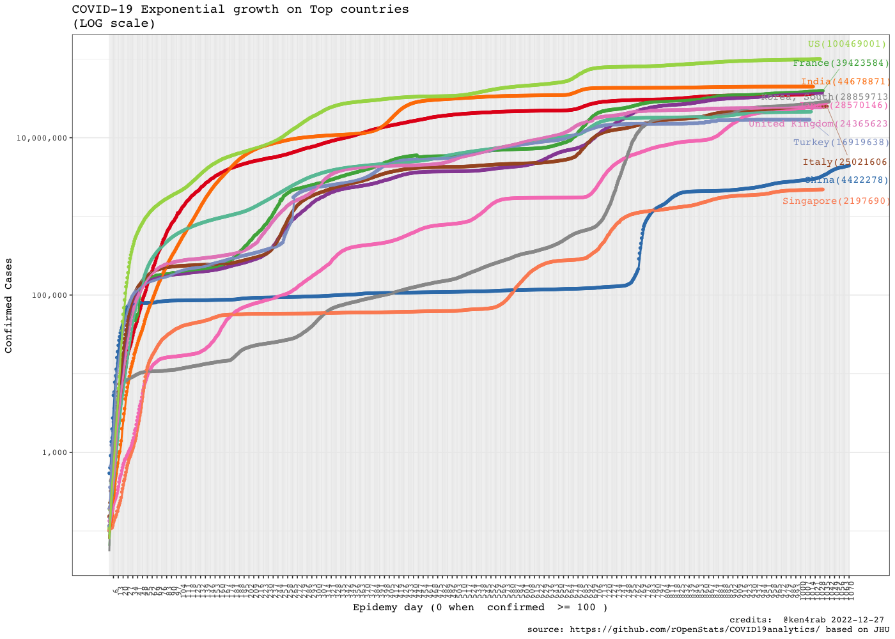

``` r
rg$ggplotCountriesLines(field = "confirmed.inc", log.scale = TRUE)
#> Warning: Removed 66 rows containing missing values (`geom_line()`).
```

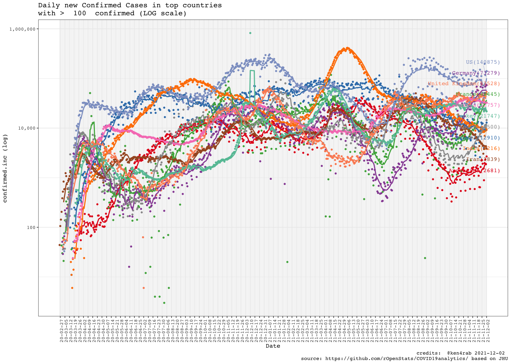

``` r
rg$ggplotCountriesLines(field = "rate.inc.daily", log.scale = TRUE)
#> Warning: Transformation introduced infinite values in continuous y-axis
#> Warning in self$trans$transform(x): NaNs produced
#> Warning: Transformation introduced infinite values in continuous y-axis
#> Warning in self$trans$transform(x): NaNs produced
#> Warning: Transformation introduced infinite values in continuous y-axis
#> Warning: Removed 116 rows containing missing values (`geom_line()`).
#> Warning: Removed 1 rows containing missing values (`geom_text_repel()`).
```

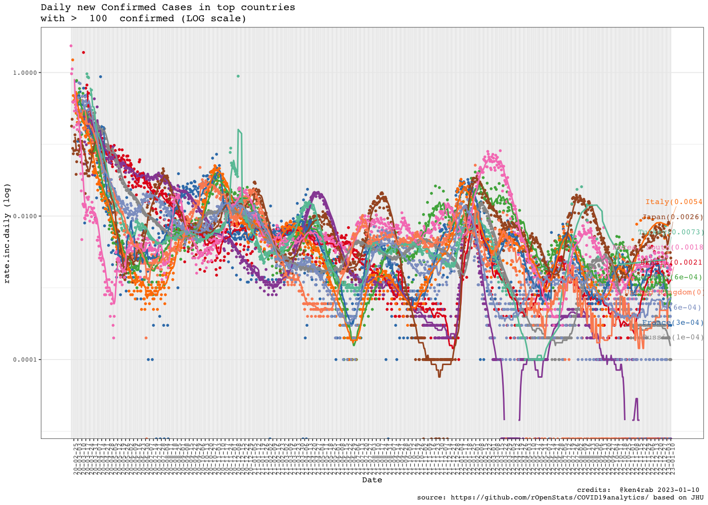

``` r
rg$ggplotTopCountriesPie()
```

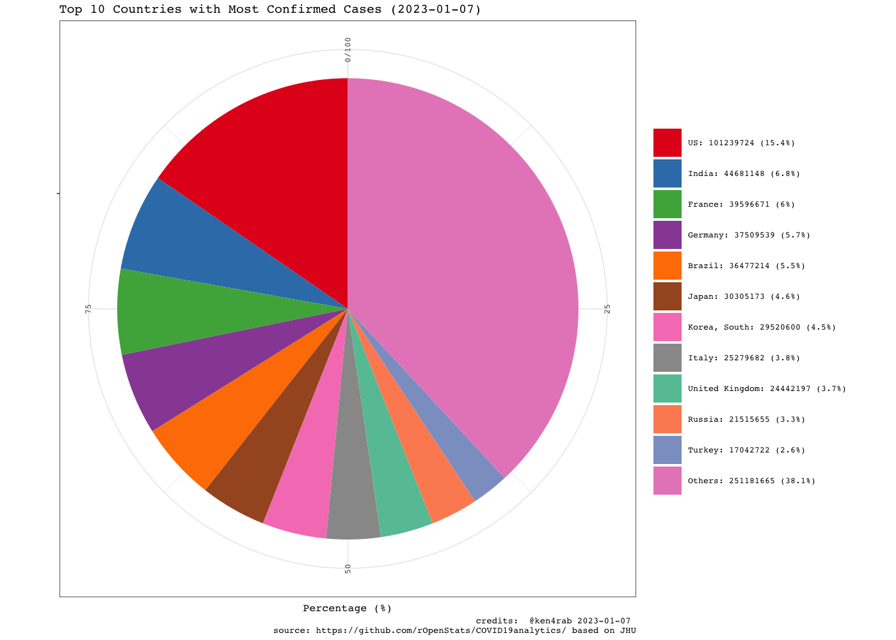

``` r
rg$ggplotTopCountriesBarPlots()
```

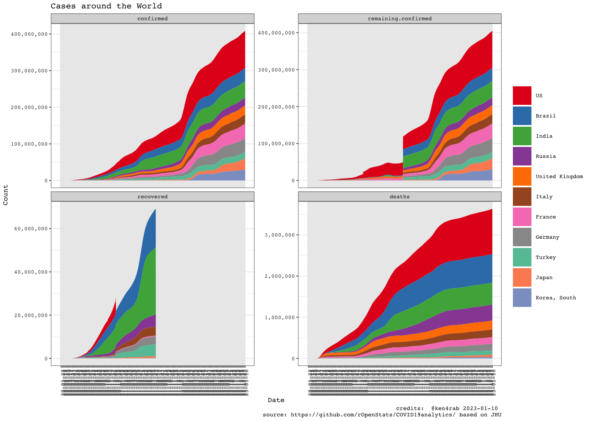

``` r
rg$ggplotCountriesBarGraphs(selected.country = "Ethiopia")
```

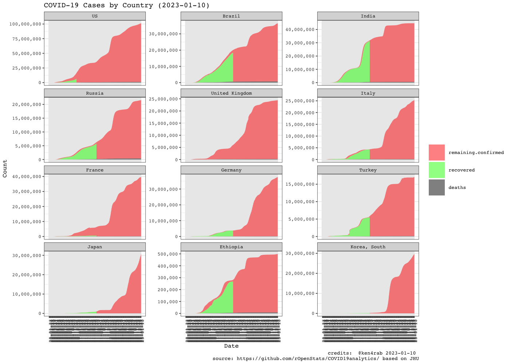
