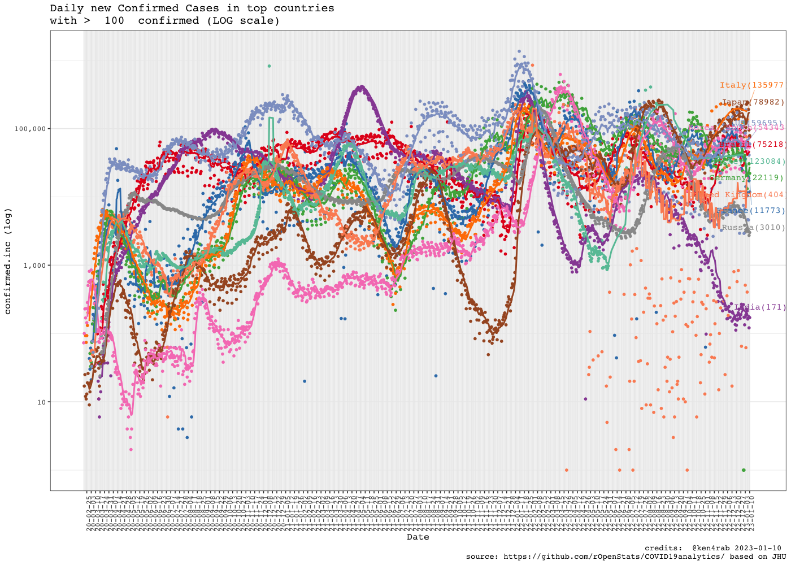

<!-- README.md is generated from README.Rmd. Please edit that file -->

# COVID19analytics

<!-- . -->

This package curate (downloads, clean, consolidate, smooth) [data from
Johns Hokpins](https://github.com/CSSEGISandData/COVID-19/) for
analysing international outbreak of COVID-19.

It includes several visualizations of the COVID-19 international
outbreak.

Yanchang Zhao, COVID-19 Data Analysis with Tidyverse and Ggplot2 -
China. RDataMining.com, 2020.

URL:
<http://www.rdatamining.com/docs/Coronavirus-data-analysis-china.pdf>.

-   COVID19DataProcessor generates curated series
-   [visualizations](https://www.r-bloggers.com/coronavirus-data-analysis-with-r-tidyverse-and-ggplot2/)
    by [Yanchang Zhao](https://www.r-bloggers.com/author/yanchang-zhao/)
    are included in ReportGenerator R6 object
-   More visualizations included int ReportGeneratorEnhanced R6 object
-   Visualizations ReportGeneratorDataComparison compares all countries
    counting epidemy day 0 when confirmed cases \> n (i.e. n = 100).

# Consideration

Data is still noisy because there are missing data from some regions in
some days. We are working on in it.

# Package

<!-- badges: start -->

| Release                                                                                                              | Usage                                                                                                    | Development                                                                                                                                                                                            |
|:---------------------------------------------------------------------------------------------------------------------|:---------------------------------------------------------------------------------------------------------|:-------------------------------------------------------------------------------------------------------------------------------------------------------------------------------------------------------|
|                                                                                                                      | [](https://cran.r-project.org/) | [](https://travis-ci.org/rOpenStats/COVID19analytics)                                                                    |
| [](https://cran.r-project.org/package=COVID19analytics) |                                                                                                          | [](https://codecov.io/gh/rOpenStats/COVID19analytics)                                                       |
|                                                                                                                      |                                                                                                          | [](https://www.repostatus.org/#active) |

<!-- badges: end -->

# How to get started (Development version)

Install the R package using the following commands on the R console:

``` r
# install.packages("devtools")
devtools::install_github("rOpenStats/COVID19analytics", build_opts = NULL)
```

# How to use it

``` r
library(COVID19analytics) 
#> Warning: replacing previous import 'ggplot2::Layout' by 'lgr::Layout' when
#> loading 'COVID19analytics'
#> Warning: replacing previous import 'readr::col_factor' by 'scales::col_factor'
#> when loading 'COVID19analytics'
#> Warning: replacing previous import 'magrittr::not' by 'testthat::not' when
#> loading 'COVID19analytics'
#> Warning: replacing previous import 'dplyr::matches' by 'testthat::matches' when
#> loading 'COVID19analytics'
#> Warning: replacing previous import 'readr::edition_get' by
#> 'testthat::edition_get' when loading 'COVID19analytics'
#> Warning: replacing previous import 'magrittr::equals' by 'testthat::equals' when
#> loading 'COVID19analytics'
#> Warning: replacing previous import 'magrittr::is_less_than' by
#> 'testthat::is_less_than' when loading 'COVID19analytics'
#> Warning: replacing previous import 'readr::local_edition' by
#> 'testthat::local_edition' when loading 'COVID19analytics'
#> Warning: replacing previous import 'testthat::matches' by 'tidyr::matches' when
#> loading 'COVID19analytics'
#> Warning: replacing previous import 'magrittr::extract' by 'tidyr::extract' when
#> loading 'COVID19analytics'
library(dplyr) 
#> 
#> Attaching package: 'dplyr'
#> The following objects are masked from 'package:stats':
#> 
#>     filter, lag
#> The following objects are masked from 'package:base':
#> 
#>     intersect, setdiff, setequal, union
```

``` r
data.processor <- COVID19DataProcessor$new(provider = "JohnsHopkingsUniversity", missing.values = "imputation")

#dummy <- data.processor$preprocess() is setupData + transform is the preprocess made by data provider
dummy <- data.processor$setupData()
#> INFO  [11:51:49.961]  {stage: `processor-setup`}
#> INFO  [11:51:50.078] Checking required downloaded  {downloaded.max.date: `2021-12-02`, daily.update.time: `21:00:00`, current.datetime: `2021-12-03 11:51:50`, download.flag: `FALSE`}
#> INFO  [11:51:50.221] Checking required downloaded  {downloaded.max.date: `2021-12-02`, daily.update.time: `21:00:00`, current.datetime: `2021-12-03 11:51:50`, download.flag: `FALSE`}
#> INFO  [11:51:50.355] Checking required downloaded  {downloaded.max.date: `2021-12-02`, daily.update.time: `21:00:00`, current.datetime: `2021-12-03 11:51:50`, download.flag: `FALSE`}
#> INFO  [11:51:50.638]  {stage: `data loaded`}
#> INFO  [11:51:50.641]  {stage: `data-setup`}
dummy <- data.processor$transform()
#> INFO  [11:51:50.643] Executing transform 
#> INFO  [11:51:50.644] Executing consolidate 
#> INFO  [11:52:10.228]  {stage: `consolidated`}
#> INFO  [11:52:10.229] Executing standarize 
#> INFO  [11:52:12.544] gathering DataModel 
#> INFO  [11:52:12.545]  {stage: `datamodel-setup`}
# Curate is the process made by missing values method
dummy <- data.processor$curate()
#> INFO  [11:52:12.552]  {stage: `loading-aggregated-data-model`}
#> Warning in countrycode_convert(sourcevar = sourcevar, origin = origin, destination = dest, : Some values were not matched unambiguously: Micronesia
#> Warning in countrycode_convert(sourcevar = sourcevar, origin = origin, destination = dest, : Some values were not matched unambiguously: MS Zaandam
#> Warning in countrycode_convert(sourcevar = sourcevar, origin = origin, destination = dest, : Some values were not matched unambiguously: Summer Olympics 2020
#> INFO  [11:52:19.077]  {stage: `calculating-rates`}
#> INFO  [11:52:19.280]  {stage: `making-data-comparison`}
#> INFO  [11:52:28.035]  {stage: `applying-missing-values-method`}
#> INFO  [11:52:28.036]  {stage: `Starting first imputation`}
#> INFO  [11:52:28.046]  {stage: `calculating-rates`}
#> INFO  [11:52:28.297]  {stage: `making-data-comparison-2`}
#> INFO  [11:52:37.132]  {stage: `calculating-top-countries`}
#> INFO  [11:52:37.150]  {stage: `curated`}

current.date <- max(data.processor$getData()$date)

rg <- ReportGeneratorEnhanced$new(data.processor)
rc <- ReportGeneratorDataComparison$new(data.processor = data.processor)


top.countries <- data.processor$top.countries
international.countries <- unique(c(data.processor$top.countries,
                                    "China", "Japan", "Singapore", "Korea, South"))
africa.countries <- sort(data.processor$countries$getCountries(division = "continent", name = "Africa"))
```

``` r
# Top 10 daily cases confirmed increment
(data.processor$getData() %>%
  filter(date == current.date) %>%
  select(country, date, rate.inc.daily, confirmed.inc, confirmed, deaths, deaths.inc) %>%
  arrange(desc(confirmed.inc)) %>%
  filter(confirmed >=10))[1:10,]
#> # A tibble: 10 × 7
#> # Groups:   country [10]
#>    country   date       rate.inc.daily confirmed.inc confirmed deaths deaths.inc
#>    <chr>     <date>              <dbl>         <int>     <int>  <int>      <int>
#>  1 US        2021-12-02         0.0029        140875  48832228 785900       3800
#>  2 Germany   2021-12-02         0.0122         73279   6072299 102573        390
#>  3 United K… 2021-12-02         0.0052         53528  10387200 145728        142
#>  4 France    2021-12-02         0.0062         48445   7877490 120311        103
#>  5 Russia    2021-12-02         0.0034         32757   9533593 272279       1188
#>  6 Poland    2021-12-02         0.0077         27354   3596491  84656        503
#>  7 Belgium   2021-12-02         0.0129         23113   1809557  27120         48
#>  8 Netherla… 2021-12-02         0.0085         23104   2726156  19974         65
#>  9 Turkey    2021-12-02         0.0025         21747   8841861  77230        192
#> 10 Czechia   2021-12-02         0.0098         21205   2193289  33317        131
```

``` r
# Top 10 daily deaths increment
(data.processor$getData() %>%
  filter(date == current.date) %>%
  select(country, date, rate.inc.daily, confirmed.inc, confirmed, deaths, deaths.inc) %>%
  arrange(desc(deaths.inc)))[1:10,]
#> # A tibble: 10 × 7
#> # Groups:   country [10]
#>    country date       rate.inc.daily confirmed.inc confirmed deaths deaths.inc
#>    <chr>   <date>              <dbl>         <int>     <int>  <int>      <int>
#>  1 US      2021-12-02         0.0029        140875  48832228 785900       3800
#>  2 Russia  2021-12-02         0.0034         32757   9533593 272279       1188
#>  3 Ukraine 2021-12-02         0.0039         14163   3633386  92418        558
#>  4 Poland  2021-12-02         0.0077         27354   3596491  84656        503
#>  5 India   2021-12-02         0.0003          9216  34615757 470115        391
#>  6 Germany 2021-12-02         0.0122         73279   6072299 102573        390
#>  7 Hungary 2021-12-02         0.0094         10466   1124726  34931        218
#>  8 Brazil  2021-12-02         0.0006         12910  22118782 615179        215
#>  9 Vietnam 2021-12-02         0.0109         13698   1266288  25658        210
#> 10 Turkey  2021-12-02         0.0025         21747   8841861  77230        192
```

``` r
rg$ggplotTopCountriesStackedBarDailyInc(included.countries = africa.countries,
                                                  countries.text = "Africa")
#> Warning: Removed 318 rows containing missing values (position_stack).
```


``` r
rc$ggplotComparisonExponentialGrowth(included.countries = africa.countries, min.cases = 20)
#> Warning: ggrepel: 33 unlabeled data points (too many overlaps). Consider
#> increasing max.overlaps
```


``` r
rg$ggplotCountriesLines(included.countries = africa.countries, countries.text = "Africa countries",
                        field = "confirmed.inc", log.scale = TRUE)
#> Warning: Removed 318 row(s) containing missing values (geom_path).
#> Warning: ggrepel: 30 unlabeled data points (too many overlaps). Consider
#> increasing max.overlaps
```


``` r
rc$ggplotComparisonExponentialGrowth(included.countries = africa.countries, 
                                     field = "deaths", y.label = "deaths", min.cases = 1)
#> Warning: ggrepel: 32 unlabeled data points (too many overlaps). Consider
#> increasing max.overlaps
```


``` r
rg$ggplotTopCountriesStackedBarDailyInc(top.countries)
#> Warning: Removed 67 rows containing missing values (position_stack).
```


``` r
rc$ggplotComparisonExponentialGrowth(included.countries = international.countries, 
                                               min.cases = 100)
#> Warning: Removed 2 row(s) containing missing values (geom_path).
#> Warning: ggrepel: 1 unlabeled data points (too many overlaps). Consider
#> increasing max.overlaps
```


``` r
rg$ggplotCountriesLines(field = "confirmed.inc", log.scale = TRUE)
#> Warning: Removed 66 row(s) containing missing values (geom_path).
```



``` r
rg$ggplotCountriesLines(field = "rate.inc.daily", log.scale = TRUE)
#> Warning: Transformation introduced infinite values in continuous y-axis

#> Warning: Removed 66 row(s) containing missing values (geom_path).
```


``` r
rg$ggplotTopCountriesPie()
```


``` r
rg$ggplotTopCountriesBarPlots()
```


``` r
rg$ggplotCountriesBarGraphs(selected.country = "Ethiopia")
```


