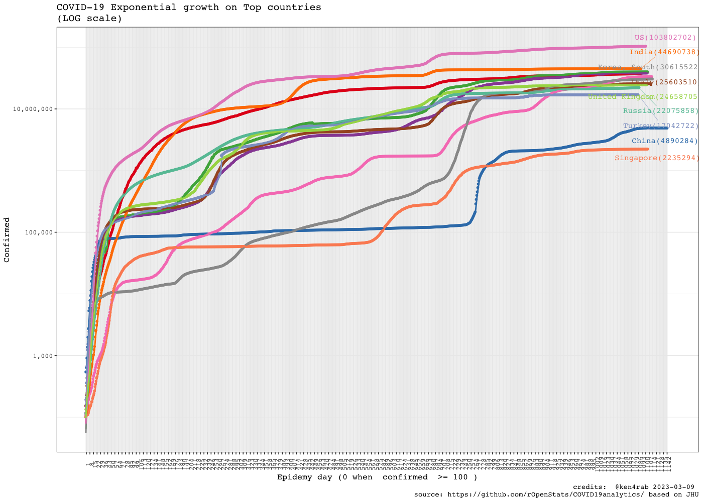
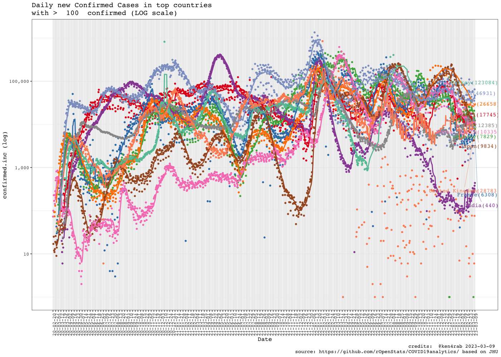

<!-- README.md is generated from README.Rmd. Please edit that file -->


# COVID19analytics

<!-- . -->

This package curate (downloads, clean, consolidate, smooth) data from
[Johns Hopkins](https://github.com/CSSEGISandData/COVID-19/) and [Our
world in data](https://ourworldindata.org/coronavirus) for analysing
international outbreak of COVID-19.

It includes several visualizations of the COVID-19 international
outbreak.

- COVID19DataProcessor generates curated series
- [visualizations](https://www.r-bloggers.com/coronavirus-data-analysis-with-r-tidyverse-and-ggplot2/)
  by [Yanchang Zhao](https://www.r-bloggers.com/author/yanchang-zhao/)
  are included in ReportGenerator R6 object
- More visualizations included int ReportGeneratorEnhanced R6 object
- Visualizations ReportGeneratorDataComparison compares all countries
  counting epidemy day 0 when confirmed cases \> n (i.e. n = 100).

# Package

<!-- badges: start -->

| Release                                                                                                              | Usage                                                                                                    | Development                                                                                                                                                                                            |
|:---------------------------------------------------------------------------------------------------------------------|:---------------------------------------------------------------------------------------------------------|:-------------------------------------------------------------------------------------------------------------------------------------------------------------------------------------------------------|
|                                                                                                                      | [](https://cran.r-project.org/) | [](https://travis-ci.org/rOpenStats/COVID19analytics)                                                                    |
| [](https://cran.r-project.org/package=COVID19analytics) |                                                                                                          | [](https://codecov.io/gh/rOpenStats/COVID19analytics)                                                       |
|                                                                                                                      |                                                                                                          | [](https://www.repostatus.org/#active) |

<!-- badges: end -->

# How to get started (Development version)

Install the R package using the following commands on the R console:

``` r
# install.packages("devtools")
devtools::install_github("rOpenStats/COVID19analytics", build_opts = NULL)
```

g First configurate environment variables with your preferred
configurations in `~/.Renviron`. COVID19analytics_data_dir is mandatory
while COVID19analytics_credits can be configured if you want to publish
your own research with space separated alias. Mention previous authors
where corresponding

``` .renviron
COVID19analytics_data_dir = "~/.R/COVID19analytics"
# If you want to generate your own reports
COVID19analytics_credits = "@alias1 @alias2 @aliasn"
```

# How to use it

``` r
library(COVID19analytics) 
#> Warning: replacing previous import 'ggplot2::Layout' by 'lgr::Layout' when
#> loading 'COVID19analytics'
#> Warning: replacing previous import 'readr::col_factor' by 'scales::col_factor'
#> when loading 'COVID19analytics'
#> Warning: replacing previous import 'readr::local_edition' by
#> 'testthat::local_edition' when loading 'COVID19analytics'
#> Warning: replacing previous import 'magrittr::is_less_than' by
#> 'testthat::is_less_than' when loading 'COVID19analytics'
#> Warning: replacing previous import 'readr::edition_get' by
#> 'testthat::edition_get' when loading 'COVID19analytics'
#> Warning: replacing previous import 'magrittr::not' by 'testthat::not' when
#> loading 'COVID19analytics'
#> Warning: replacing previous import 'magrittr::equals' by 'testthat::equals'
#> when loading 'COVID19analytics'
#> Warning: replacing previous import 'dplyr::matches' by 'testthat::matches' when
#> loading 'COVID19analytics'
#> Warning: replacing previous import 'magrittr::extract' by 'tidyr::extract' when
#> loading 'COVID19analytics'
#> Warning: replacing previous import 'testthat::matches' by 'tidyr::matches' when
#> loading 'COVID19analytics'
library(dplyr)
#> 
#> Attaching package: 'dplyr'
#> The following objects are masked from 'package:stats':
#> 
#>     filter, lag
#> The following objects are masked from 'package:base':
#> 
#>     intersect, setdiff, setequal, union
library(knitr)
library(lgr)
```

``` r
log.dir <- file.path(getEnv("data_dir"), "logs")
dir.create(log.dir, recursive = TRUE, showWarnings = FALSE)
log.file <- file.path(log.dir, "covid19analytics.log")
lgr::get_logger("root")$add_appender(AppenderFile$new(log.file))
lgr::threshold("info", lgr::get_logger("root"))
lgr::threshold("info", lgr::get_logger("COVID19ARCurator"))
```

``` r
data.processor <- COVID19DataProcessor$new(provider = "JohnsHopkingsUniversity", missing.values = "imputation")

#dummy <- data.processor$preprocess() is setupData + transform is the preprocess made by data provider
dummy <- data.processor$setupData()
#> INFO  [09:59:13.346]  {stage: `processor-setup`}
#> INFO  [09:59:13.450] Checking required downloaded  {downloaded.max.date: `2023-03-09`, daily.update.time: `21:00:00`, current.datetime: `2023-07-08 09:59:13.449607`, download.flag: `TRUE`}
#> INFO  [09:59:48.817] Checking required downloaded  {downloaded.max.date: `2023-03-09`, daily.update.time: `21:00:00`, current.datetime: `2023-07-08 09:59:48.795593`, download.flag: `TRUE`}
#> INFO  [10:00:27.158] Checking required downloaded  {downloaded.max.date: `2023-03-09`, daily.update.time: `21:00:00`, current.datetime: `2023-07-08 10:00:27.154519`, download.flag: `TRUE`}
#> INFO  [10:00:29.656]  {stage: `data loaded`}
#> INFO  [10:00:29.657]  {stage: `data-setup`}
dummy <- data.processor$transform()
#> INFO  [10:00:29.660] Executing transform
#> INFO  [10:00:29.661] Executing consolidate
#> INFO  [10:00:40.661]  {stage: `consolidated`}
#> INFO  [10:00:40.663] Executing standarize
#> INFO  [10:00:41.515] gathering DataModel
#> INFO  [10:00:41.516]  {stage: `datamodel-setup`}
# Curate is the process made by missing values method
dummy <- data.processor$curate()
#> INFO  [10:00:41.520]  {stage: `loading-aggregated-data-model`}
#> Warning: Some values were not matched unambiguously: Antarctica
#> Warning: Some values were not matched unambiguously: Micronesia
#> Warning: Some values were not matched unambiguously: MS Zaandam
#> Warning: Some values were not matched unambiguously: Summer Olympics 2020
#> Warning: Some values were not matched unambiguously: Winter Olympics 2022
#> INFO  [10:00:43.390]  {stage: `calculating-rates`}
#> INFO  [10:00:43.483]  {stage: `making-data-comparison`}
#> INFO  [10:00:47.676]  {stage: `applying-missing-values-method`}
#> INFO  [10:00:47.678]  {stage: `Starting first imputation`}
#> INFO  [10:00:47.684]  {stage: `calculating-rates`}
#> INFO  [10:00:47.831]  {stage: `making-data-comparison-2`}
#> INFO  [10:00:51.699]  {stage: `calculating-top-countries`}
#> INFO  [10:00:51.714]  {stage: `curated`}

current.date <- max(data.processor$getData()$date)

rg <- ReportGeneratorEnhanced$new(data.processor)
rc <- ReportGeneratorDataComparison$new(data.processor = data.processor)

top.countries <- data.processor$top.countries
international.countries <- unique(c(data.processor$top.countries,
                                    "China", "Japan", "Singapore", "Korea, South"))
latam.countries <- sort(c("Mexico",
                     data.processor$countries$getCountries(division = "sub.continent", name = "Caribbean"),
                     data.processor$countries$getCountries(division = "sub.continent", name = "Central America"),
                     data.processor$countries$getCountries(division = "sub.continent", name = "South America")))
```

``` r
# Top 10 daily cases confirmed increment
kable((data.processor$getData() %>%
  filter(date == current.date) %>%
  select(country, date, rate.inc.daily, confirmed.inc, confirmed, deaths, deaths.inc) %>%
  arrange(desc(confirmed.inc)) %>%
  filter(confirmed >=10))[1:10,])
```

| country        | date       | rate.inc.daily | confirmed.inc | confirmed |  deaths | deaths.inc |
|:---------------|:-----------|---------------:|--------------:|----------:|--------:|-----------:|
| US             | 2023-03-09 |         0.0005 |         46931 | 103802702 | 1123836 |        590 |
| United Kingdom | 2023-03-09 |         0.0012 |         28783 |  24658705 |  220721 |          0 |
| Australia      | 2023-03-09 |         0.0012 |         13926 |  11399460 |   19574 |        115 |
| Russia         | 2023-03-09 |         0.0006 |         12385 |  22075858 |  388478 |         38 |
| Belgium        | 2023-03-09 |         0.0024 |         11570 |   4739365 |   33814 |         39 |
| Korea, South   | 2023-03-09 |         0.0003 |         10335 |  30615522 |   34093 |         12 |
| Japan          | 2023-03-09 |         0.0003 |          9834 |  33320438 |   72997 |         80 |
| Germany        | 2023-03-09 |         0.0002 |          7829 |  38249060 |  168935 |        127 |
| France         | 2023-03-09 |         0.0002 |          6308 |  39866718 |  166176 |         11 |
| Austria        | 2023-03-09 |         0.0009 |          5283 |   5961143 |   21970 |         21 |

``` r
# Top 10 daily deaths increment
kable((data.processor$getData() %>%
  filter(date == current.date) %>%
  select(country, date, rate.inc.daily, confirmed.inc, confirmed, deaths, deaths.inc) %>%
  arrange(desc(deaths.inc)))[1:10,])
```

| country   | date       | rate.inc.daily | confirmed.inc | confirmed |  deaths | deaths.inc |
|:----------|:-----------|---------------:|--------------:|----------:|--------:|-----------:|
| US        | 2023-03-09 |         0.0005 |         46931 | 103802702 | 1123836 |        590 |
| Germany   | 2023-03-09 |         0.0002 |          7829 |  38249060 |  168935 |        127 |
| Australia | 2023-03-09 |         0.0012 |         13926 |  11399460 |   19574 |        115 |
| Japan     | 2023-03-09 |         0.0003 |          9834 |  33320438 |   72997 |         80 |
| Sweden    | 2023-03-09 |         0.0003 |           804 |   2699339 |   23777 |         46 |
| Belgium   | 2023-03-09 |         0.0024 |         11570 |   4739365 |   33814 |         39 |
| Russia    | 2023-03-09 |         0.0006 |         12385 |  22075858 |  388478 |         38 |
| Finland   | 2023-03-09 |         0.0005 |           668 |   1463644 |    8967 |         31 |
| Austria   | 2023-03-09 |         0.0009 |          5283 |   5961143 |   21970 |         21 |
| Poland    | 2023-03-09 |         0.0005 |          3459 |   6444960 |  119010 |         21 |

``` r
 rg$ggplotTopCountriesStackedBarDailyInc(included.countries = latam.countries, countries.text = "Latam countries")
#> Warning: Removed 144 rows containing missing values (`position_stack()`).
```


``` r
rc$ggplotComparisonExponentialGrowth(included.countries = latam.countries, countries.text = "Latam countries",   
                                     field = "confirmed", y.label = "Confirmed", min.cases = 100)
#> Warning: ggrepel: 7 unlabeled data points (too many overlaps). Consider
#> increasing max.overlaps
```


``` r
rc$ggplotComparisonExponentialGrowth(included.countries = latam.countries, countries.text = "Latam countries",   
                                     field = "remaining.confirmed", y.label = "Active cases", min.cases = 100)
#> Warning in self$trans$transform(x): NaNs produced
#> Warning: Transformation introduced infinite values in continuous y-axis
#> Warning: ggrepel: 7 unlabeled data points (too many overlaps). Consider
#> increasing max.overlaps
```


``` r
rc$ggplotComparisonExponentialGrowth(included.countries = latam.countries, field = "deaths", y.label = "Deaths", min.cases = 1)
```


``` r

rg$ggplotCrossSection(included.countries = latam.countries,
                       field.x = "confirmed",
                       field.y = "fatality.rate.max",
                       plot.description  = "Cross section Confirmed vs  Death rate min",
                       log.scale.x = TRUE,
                       log.scale.y = FALSE)
#> Warning: Removed 144 rows containing missing values (`geom_line()`).
```


``` r

rg$ggplotCountriesLines(included.countries = latam.countries, countries.text = "Latam countries",
                        field = "confirmed.inc", log.scale = TRUE)
#> Warning: Removed 144 rows containing missing values (`geom_line()`).
```


``` r
rg$ggplotCountriesLines(included.countries = latam.countries, countries.text = "Latam countries",
                        field = "deaths.inc", log.scale = TRUE)
#> Warning in self$trans$transform(x): NaNs produced
#> Warning: Transformation introduced infinite values in continuous y-axis
#> Warning in self$trans$transform(x): NaNs produced
#> Warning: Transformation introduced infinite values in continuous y-axis
#> Transformation introduced infinite values in continuous y-axis
#> Warning: Removed 12 rows containing missing values (`geom_point()`).
#> Warning: Removed 144 rows containing missing values (`geom_line()`).
```


``` r
rg$ggplotCountriesLines(included.countries = latam.countries, countries.text = "Latam countries",
                        field = "rate.inc.daily", log.scale = TRUE)
#> Warning: Transformation introduced infinite values in continuous y-axis
#> Warning in self$trans$transform(x): NaNs produced
#> Warning: Transformation introduced infinite values in continuous y-axis
#> Warning in self$trans$transform(x): NaNs produced
#> Warning: Transformation introduced infinite values in continuous y-axis
#> Warning: Removed 321 rows containing missing values (`geom_line()`).
#> Warning: Removed 1 rows containing missing values (`geom_text_repel()`).
#> Warning: ggrepel: 23 unlabeled data points (too many overlaps). Consider
#> increasing max.overlaps
```


``` r
rg$ggplotTopCountriesStackedBarDailyInc(top.countries)
#> Warning: There were 3 warnings in `mutate()`.
#> The first warning was:
#> ℹ In argument: `country = fct_reorder(country, desc(max.count))`.
#> ℹ In group 1: `country = "US"`.
#> Caused by warning:
#> ! `fct_reorder()` removing 1143 missing values.
#> ℹ Use `.na_rm = TRUE` to silence this message.
#> ℹ Use `.na_rm = FALSE` to preserve NAs.
#> ℹ Run `dplyr::last_dplyr_warnings()` to see the 2 remaining warnings.
#> Warning: Removed 69 rows containing missing values (`position_stack()`).
```


``` r
rc$ggplotComparisonExponentialGrowth(included.countries = international.countries, 
                                     field = "confirmed", y.label = "Confirmed", min.cases = 100)
#> Warning: Removed 2 rows containing missing values (`geom_line()`).
#> Warning: ggrepel: 4 unlabeled data points (too many overlaps). Consider
#> increasing max.overlaps
```



``` r
rc$ggplotComparisonExponentialGrowth(included.countries = international.countries, 
                                     field = "remaining.confirmed", y.label = "Active cases", min.cases = 100)
#> Warning: Removed 2 rows containing missing values (`geom_line()`).
#> ggrepel: 4 unlabeled data points (too many overlaps). Consider increasing max.overlaps
```


``` r
rc$ggplotComparisonExponentialGrowth(included.countries = international.countries, field = "deaths", 
                                     y.label = "Deaths", min.cases = 1)
#> Warning: Removed 2 rows containing missing values (`geom_line()`).
```


``` r
rg$ggplotCrossSection(included.countries = international.countries,
                       field.x = "confirmed",
                       field.y = "fatality.rate.max",
                       plot.description  = "Cross section Confirmed vs Death rate min",
                       log.scale.x = TRUE,
                       log.scale.y = FALSE)
#> Warning: Removed 78 rows containing missing values (`geom_line()`).
```


``` r
rg$ggplotCountriesLines(field = "confirmed.inc", log.scale = TRUE)
#> Warning: Removed 66 rows containing missing values (`geom_line()`).
```



``` r
rg$ggplotCountriesLines(field = "deaths.inc", log.scale = TRUE)
#> Warning in self$trans$transform(x): NaNs produced
#> Warning: Transformation introduced infinite values in continuous y-axis
#> Transformation introduced infinite values in continuous y-axis
#> Transformation introduced infinite values in continuous y-axis
#> Warning: Removed 17 rows containing missing values (`geom_point()`).
#> Warning: Removed 66 rows containing missing values (`geom_line()`).
```


``` r
rg$ggplotCountriesLines(field = "rate.inc.daily", log.scale = TRUE)
#> Warning: Transformation introduced infinite values in continuous y-axis
#> Warning in self$trans$transform(x): NaNs produced
#> Warning: Transformation introduced infinite values in continuous y-axis
#> Warning in self$trans$transform(x): NaNs produced
#> Warning: Transformation introduced infinite values in continuous y-axis
#> Warning: Removed 176 rows containing missing values (`geom_line()`).
#> Warning: Removed 1 rows containing missing values (`geom_text_repel()`).
#> Warning: ggrepel: 5 unlabeled data points (too many overlaps). Consider
#> increasing max.overlaps
```


``` r
rg$ggplotTopCountriesPie()
```


``` r
rg$ggplotTopCountriesBarPlots()
```


``` r
rg$ggplotCountriesBarGraphs(selected.country = "Argentina")
```


# References

- Johns Hopkins University. Retrieved from:
  ‘<https://github.com/CSSEGISandData/COVID-19/>’ \[Online Resource\]

- OurWorldInData.org. Retrieved from:
  ‘<https://ourworldindata.org/coronavirus>’ \[Online Resource\]

Yanchang Zhao, COVID-19 Data Analysis with Tidyverse and Ggplot2 -
China. RDataMining.com, 2020.

URL:
<http://www.rdatamining.com/docs/Coronavirus-data-analysis-china.pdf>.
