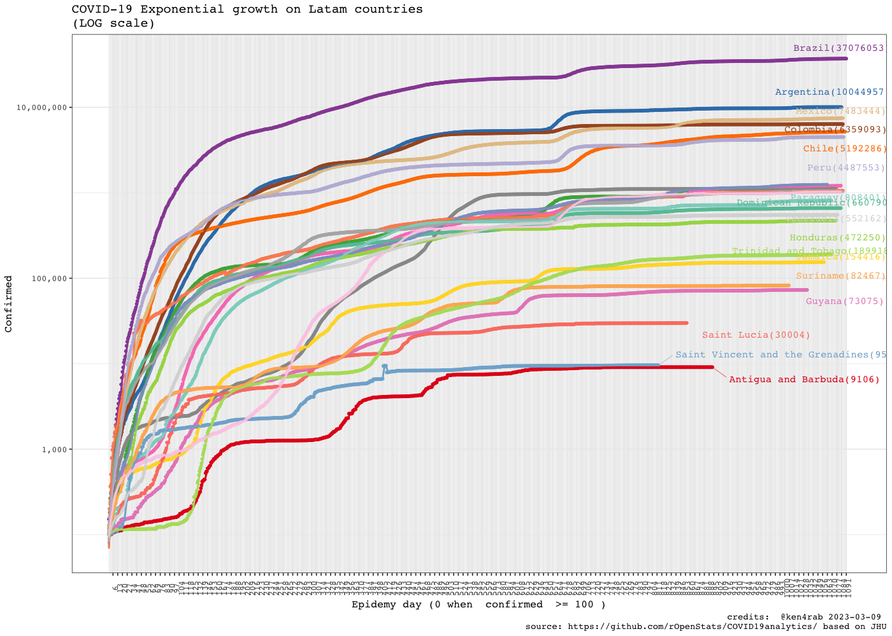
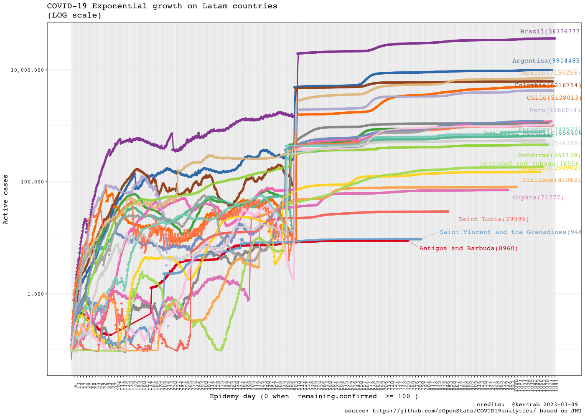
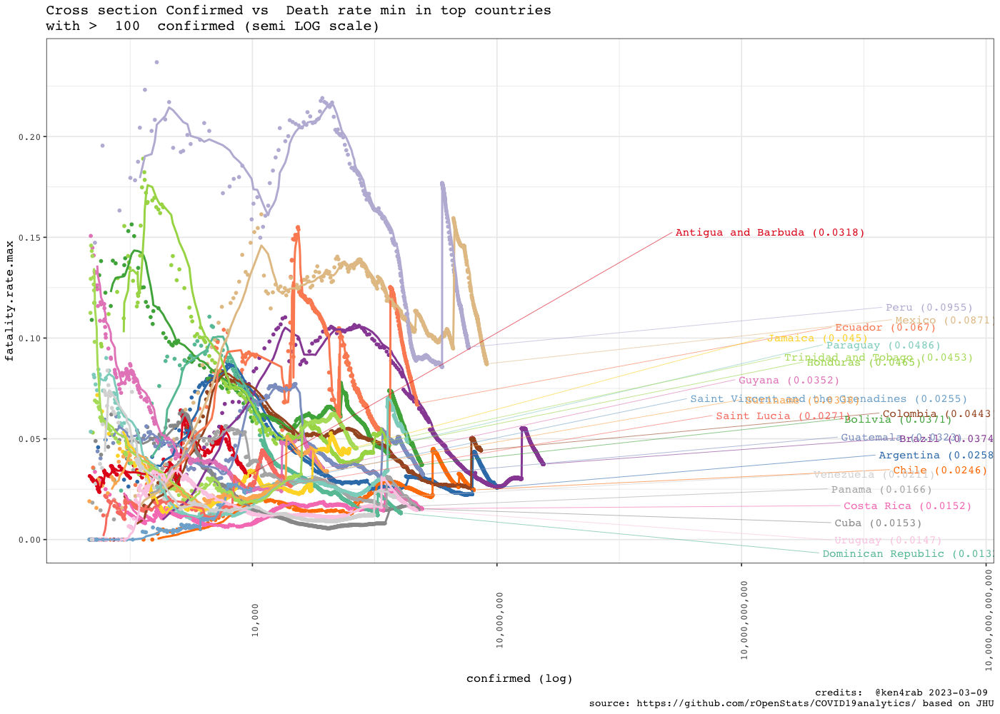
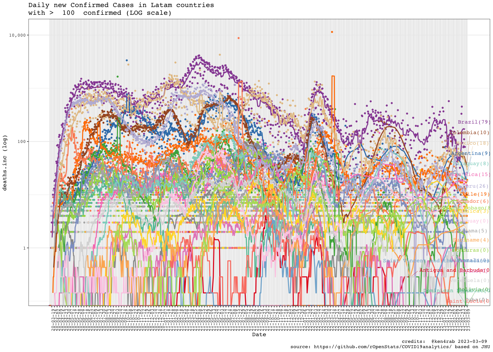
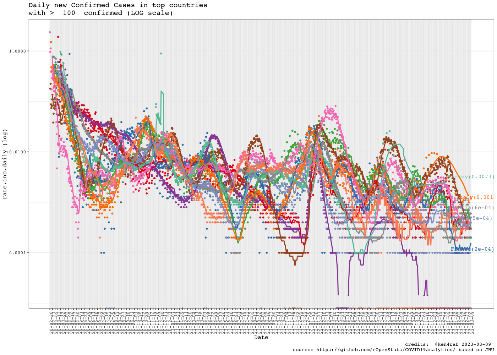

<!-- README.md is generated from README.Rmd. Please edit that file -->


# COVID19analytics

<!-- . -->

This package curate (downloads, clean, consolidate, smooth) data from
[Johns Hopkins](https://github.com/CSSEGISandData/COVID-19/) and [Our
world in data](https://ourworldindata.org/coronavirus) for analysing
international outbreak of COVID-19.

It includes several visualizations of the COVID-19 international
outbreak.

- COVID19DataProcessor generates curated series
- [visualizations](https://www.r-bloggers.com/coronavirus-data-analysis-with-r-tidyverse-and-ggplot2/)
  by [Yanchang Zhao](https://www.r-bloggers.com/author/yanchang-zhao/)
  are included in ReportGenerator R6 object
- More visualizations included int ReportGeneratorEnhanced R6 object
- Visualizations ReportGeneratorDataComparison compares all countries
  counting epidemy day 0 when confirmed cases \> n (i.e. n = 100).

# Package

<!-- badges: start -->

| Release                                                                                                              | Usage                                                                                                    | Development                                                                                                                                                                                            |
|:---------------------------------------------------------------------------------------------------------------------|:---------------------------------------------------------------------------------------------------------|:-------------------------------------------------------------------------------------------------------------------------------------------------------------------------------------------------------|
|                                                                                                                      | [](https://cran.r-project.org/) | [](https://travis-ci.org/rOpenStats/COVID19analytics)                                                                    |
| [](https://cran.r-project.org/package=COVID19analytics) |                                                                                                          | [](https://codecov.io/gh/rOpenStats/COVID19analytics)                                                       |
|                                                                                                                      |                                                                                                          | [](https://www.repostatus.org/#active) |

<!-- badges: end -->

# How to get started (Development version)

Install the R package using the following commands on the R console:

``` r
# install.packages("devtools")
devtools::install_github("rOpenStats/COVID19analytics", build_opts = NULL)
```

g First configurate environment variables with your preferred
configurations in `~/.Renviron`. COVID19analytics_data_dir is mandatory
while COVID19analytics_credits can be configured if you want to publish
your own research with space separated alias. Mention previous authors
where corresponding

``` .renviron
COVID19analytics_data_dir = "~/.R/COVID19analytics"
# If you want to generate your own reports
COVID19analytics_credits = "@alias1 @alias2 @aliasn"
```

# How to use it

``` r
library(COVID19analytics) 
#> Warning: replacing previous import 'ggplot2::Layout' by 'lgr::Layout' when
#> loading 'COVID19analytics'
#> Warning: replacing previous import 'readr::col_factor' by 'scales::col_factor'
#> when loading 'COVID19analytics'
#> Warning: replacing previous import 'magrittr::not' by 'testthat::not' when
#> loading 'COVID19analytics'
#> Warning: replacing previous import 'dplyr::matches' by 'testthat::matches' when
#> loading 'COVID19analytics'
#> Warning: replacing previous import 'readr::edition_get' by
#> 'testthat::edition_get' when loading 'COVID19analytics'
#> Warning: replacing previous import 'magrittr::equals' by 'testthat::equals' when
#> loading 'COVID19analytics'
#> Warning: replacing previous import 'magrittr::is_less_than' by
#> 'testthat::is_less_than' when loading 'COVID19analytics'
#> Warning: replacing previous import 'readr::local_edition' by
#> 'testthat::local_edition' when loading 'COVID19analytics'
#> Warning: replacing previous import 'testthat::matches' by 'tidyr::matches' when
#> loading 'COVID19analytics'
#> Warning: replacing previous import 'magrittr::extract' by 'tidyr::extract' when
#> loading 'COVID19analytics'
library(dplyr)
#> 
#> Attaching package: 'dplyr'
#> The following objects are masked from 'package:stats':
#> 
#>     filter, lag
#> The following objects are masked from 'package:base':
#> 
#>     intersect, setdiff, setequal, union
library(knitr)
library(lgr)
```

``` r
log.dir <- file.path(getEnv("data_dir"), "logs")
dir.create(log.dir, recursive = TRUE, showWarnings = FALSE)
log.file <- file.path(log.dir, "covid19analytics.log")
lgr::get_logger("root")$add_appender(AppenderFile$new(log.file))
lgr::threshold("info", lgr::get_logger("root"))
lgr::threshold("info", lgr::get_logger("COVID19ARCurator"))
```

``` r
data.processor <- COVID19DataProcessor$new(provider = "JohnsHopkingsUniversity", missing.values = "imputation")

#dummy <- data.processor$preprocess() is setupData + transform is the preprocess made by data provider
dummy <- data.processor$setupData()
#> INFO  [08:12:17.763]  {stage: `processor-setup`}
#> INFO  [08:12:17.988] Checking required downloaded  {downloaded.max.date: `2022-08-25`, daily.update.time: `21:00:00`, current.datetime: `2022-08-27 08:12:17`, download.flag: `TRUE`}
#> INFO  [08:12:19.244] Checking required downloaded  {downloaded.max.date: `2022-08-25`, daily.update.time: `21:00:00`, current.datetime: `2022-08-27 08:12:19`, download.flag: `TRUE`}
#> INFO  [08:12:20.621] Checking required downloaded  {downloaded.max.date: `2022-08-25`, daily.update.time: `21:00:00`, current.datetime: `2022-08-27 08:12:20`, download.flag: `TRUE`}
#> INFO  [08:12:21.799]  {stage: `data loaded`}
#> INFO  [08:12:21.802]  {stage: `data-setup`}
dummy <- data.processor$transform()
#> INFO  [08:12:21.806] Executing transform 
#> INFO  [08:12:21.809] Executing consolidate 
#> INFO  [08:12:55.931]  {stage: `consolidated`}
#> INFO  [08:12:55.933] Executing standarize 
#> INFO  [08:13:00.260] gathering DataModel 
#> INFO  [08:13:00.262]  {stage: `datamodel-setup`}
# Curate is the process made by missing values method
dummy <- data.processor$curate()
#> INFO  [08:13:00.273]  {stage: `loading-aggregated-data-model`}
#> Warning in countrycode_convert(sourcevar = sourcevar, origin = origin, destination = dest, : Some values were not matched unambiguously: Antarctica
#> Warning in countrycode_convert(sourcevar = sourcevar, origin = origin, destination = dest, : Some values were not matched unambiguously: Micronesia
#> Warning in countrycode_convert(sourcevar = sourcevar, origin = origin, destination = dest, : Some values were not matched unambiguously: MS Zaandam
#> Warning in countrycode_convert(sourcevar = sourcevar, origin = origin, destination = dest, : Some values were not matched unambiguously: Summer Olympics 2020
#> Warning in countrycode_convert(sourcevar = sourcevar, origin = origin, destination = dest, : Some values were not matched unambiguously: Winter Olympics 2022
#> INFO  [08:13:05.080]  {stage: `calculating-rates`}
#> INFO  [08:13:05.414]  {stage: `making-data-comparison`}
#> INFO  [08:13:21.162]  {stage: `applying-missing-values-method`}
#> INFO  [08:13:21.164]  {stage: `Starting first imputation`}
#> INFO  [08:13:21.193]  {stage: `calculating-rates`}
#> INFO  [08:13:21.569]  {stage: `making-data-comparison-2`}
#> INFO  [08:13:36.891]  {stage: `calculating-top-countries`}
#> INFO  [08:13:36.929]  {stage: `curated`}

current.date <- max(data.processor$getData()$date)

rg <- ReportGeneratorEnhanced$new(data.processor)
rc <- ReportGeneratorDataComparison$new(data.processor = data.processor)

top.countries <- data.processor$top.countries
international.countries <- unique(c(data.processor$top.countries,
                                    "China", "Japan", "Singapore", "Korea, South"))
latam.countries <- sort(c("Mexico",
                     data.processor$countries$getCountries(division = "sub.continent", name = "Caribbean"),
                     data.processor$countries$getCountries(division = "sub.continent", name = "Central America"),
                     data.processor$countries$getCountries(division = "sub.continent", name = "South America")))
```

``` r
# Top 10 daily cases confirmed increment
kable((data.processor$getData() %>%
  filter(date == current.date) %>%
  select(country, date, rate.inc.daily, confirmed.inc, confirmed, deaths, deaths.inc) %>%
  arrange(desc(confirmed.inc)) %>%
  filter(confirmed >=10))[1:10,])
```

| country      | date       | rate.inc.daily | confirmed.inc | confirmed |  deaths | deaths.inc |
|:-------------|:-----------|---------------:|--------------:|----------:|--------:|-----------:|
| Japan        | 2022-08-26 |         0.0107 |        192305 |  18194170 |   38565 |        321 |
| US           | 2022-08-26 |         0.0015 |        142220 |  94171060 | 1043783 |        694 |
| Korea, South | 2022-08-26 |         0.0042 |         95538 |  22898523 |   26499 |         86 |
| Russia       | 2022-08-26 |         0.0024 |         45792 |  19030966 |  376131 |         79 |
| Germany      | 2022-08-26 |         0.0010 |         33226 |  32041348 |  147104 |        101 |
| Taiwan\*     | 2022-08-26 |         0.0052 |         26718 |   5168997 |    9773 |         45 |
| Italy        | 2022-08-26 |         0.0010 |         21995 |  21767060 |  175226 |         99 |
| Brazil       | 2022-08-26 |         0.0005 |         18270 |  34368909 |  683397 |        164 |
| France       | 2022-08-26 |         0.0005 |         18116 |  34662834 |  154897 |         51 |
| Australia    | 2022-08-26 |         0.0011 |         11177 |   9987913 |   13734 |         87 |

``` r
# Top 10 daily deaths increment
kable((data.processor$getData() %>%
  filter(date == current.date) %>%
  select(country, date, rate.inc.daily, confirmed.inc, confirmed, deaths, deaths.inc) %>%
  arrange(desc(deaths.inc)))[1:10,])
```

| country      | date       | rate.inc.daily | confirmed.inc | confirmed |  deaths | deaths.inc |
|:-------------|:-----------|---------------:|--------------:|----------:|--------:|-----------:|
| US           | 2022-08-26 |         0.0015 |        142220 |  94171060 | 1043783 |        694 |
| Japan        | 2022-08-26 |         0.0107 |        192305 |  18194170 |   38565 |        321 |
| Spain        | 2022-08-26 |         0.0007 |          9192 |  13332976 |  112454 |        208 |
| Brazil       | 2022-08-26 |         0.0005 |         18270 |  34368909 |  683397 |        164 |
| Germany      | 2022-08-26 |         0.0010 |         33226 |  32041348 |  147104 |        101 |
| Italy        | 2022-08-26 |         0.0010 |         21995 |  21767060 |  175226 |         99 |
| Australia    | 2022-08-26 |         0.0011 |         11177 |   9987913 |   13734 |         87 |
| Korea, South | 2022-08-26 |         0.0042 |         95538 |  22898523 |   26499 |         86 |
| Russia       | 2022-08-26 |         0.0024 |         45792 |  19030966 |  376131 |         79 |
| France       | 2022-08-26 |         0.0005 |         18116 |  34662834 |  154897 |         51 |

``` r
rg$ggplotTopCountriesStackedBarDailyInc(included.countries = latam.countries, countries.text = "Latam countries")
#> Warning: Removed 144 rows containing missing values (position_stack).
```


``` r
rc$ggplotComparisonExponentialGrowth(included.countries = latam.countries, countries.text = "Latam countries",   
                                     field = "confirmed", y.label = "Confirmed", min.cases = 100)
#> Warning: ggrepel: 4 unlabeled data points (too many overlaps). Consider
#> increasing max.overlaps
```



``` r
rc$ggplotComparisonExponentialGrowth(included.countries = latam.countries, countries.text = "Latam countries",   
                                     field = "remaining.confirmed", y.label = "Active cases", min.cases = 100)
#> Warning in self$trans$transform(x): NaNs produced
#> Warning: Transformation introduced infinite values in continuous y-axis
#> Warning: ggrepel: 4 unlabeled data points (too many overlaps). Consider
#> increasing max.overlaps
```



``` r
rc$ggplotComparisonExponentialGrowth(included.countries = latam.countries, field = "deaths", y.label = "Deaths", min.cases = 1)
```


``` r

rg$ggplotCrossSection(included.countries = latam.countries,
                       field.x = "confirmed",
                       field.y = "fatality.rate.max",
                       plot.description  = "Cross section Confirmed vs  Death rate min",
                       log.scale.x = TRUE,
                       log.scale.y = FALSE)
#> Warning: Removed 144 row(s) containing missing values (geom_path).
```



``` r

rg$ggplotCountriesLines(included.countries = latam.countries, countries.text = "Latam countries",
                        field = "confirmed.inc", log.scale = TRUE)
#> Warning: Removed 144 row(s) containing missing values (geom_path).
```


``` r
rg$ggplotCountriesLines(included.countries = latam.countries, countries.text = "Latam countries",
                        field = "deaths.inc", log.scale = TRUE)
#> Warning in self$trans$transform(x): NaNs produced
#> Warning: Transformation introduced infinite values in continuous y-axis
#> Warning in self$trans$transform(x): NaNs produced
#> Warning: Transformation introduced infinite values in continuous y-axis
#> Transformation introduced infinite values in continuous y-axis
#> Warning: Removed 8 rows containing missing values (geom_point).
#> Warning: Removed 144 row(s) containing missing values (geom_path).
```



``` r
rg$ggplotCountriesLines(included.countries = latam.countries, countries.text = "Latam countries",
                        field = "rate.inc.daily", log.scale = TRUE)
#> Warning: Transformation introduced infinite values in continuous y-axis
#> Warning in self$trans$transform(x): NaNs produced
#> Warning: Transformation introduced infinite values in continuous y-axis
#> Warning: Removed 144 row(s) containing missing values (geom_path).
#> Warning: ggrepel: 22 unlabeled data points (too many overlaps). Consider
#> increasing max.overlaps
```


``` r
rg$ggplotTopCountriesStackedBarDailyInc(top.countries)
#> Warning: Removed 69 rows containing missing values (position_stack).
```


``` r
rc$ggplotComparisonExponentialGrowth(included.countries = international.countries, 
                                     field = "confirmed", y.label = "Confirmed", min.cases = 100)
#> Warning: Removed 2 row(s) containing missing values (geom_path).
#> Warning: ggrepel: 2 unlabeled data points (too many overlaps). Consider
#> increasing max.overlaps
```


``` r
rc$ggplotComparisonExponentialGrowth(included.countries = international.countries, 
                                     field = "remaining.confirmed", y.label = "Active cases", min.cases = 100)
#> Warning: Removed 2 row(s) containing missing values (geom_path).
#> ggrepel: 2 unlabeled data points (too many overlaps). Consider increasing max.overlaps
```


``` r
rc$ggplotComparisonExponentialGrowth(included.countries = international.countries, field = "deaths", 
                                     y.label = "Deaths", min.cases = 1)
#> Warning: Removed 2 row(s) containing missing values (geom_path).
```


``` r
rg$ggplotCrossSection(included.countries = international.countries,
                       field.x = "confirmed",
                       field.y = "fatality.rate.max",
                       plot.description  = "Cross section Confirmed vs Death rate min",
                       log.scale.x = TRUE,
                       log.scale.y = FALSE)
#> Warning: Removed 78 row(s) containing missing values (geom_path).
```


``` r
rg$ggplotCountriesLines(field = "confirmed.inc", log.scale = TRUE)
#> Warning: Removed 66 row(s) containing missing values (geom_path).
```


``` r
rg$ggplotCountriesLines(field = "deaths.inc", log.scale = TRUE)
#> Warning in self$trans$transform(x): NaNs produced
#> Warning: Transformation introduced infinite values in continuous y-axis
#> Warning in self$trans$transform(x): NaNs produced
#> Warning: Transformation introduced infinite values in continuous y-axis
#> Warning in self$trans$transform(x): NaNs produced
#> Warning: Transformation introduced infinite values in continuous y-axis
#> Warning: Removed 13 rows containing missing values (geom_point).
#> Warning: Removed 68 row(s) containing missing values (geom_path).
#> Warning: Removed 1 rows containing missing values (geom_text_repel).
```


``` r
rg$ggplotCountriesLines(field = "rate.inc.daily", log.scale = TRUE)
#> Warning: Transformation introduced infinite values in continuous y-axis
#> Warning in self$trans$transform(x): NaNs produced
#> Warning: Transformation introduced infinite values in continuous y-axis
#> Warning: Removed 66 row(s) containing missing values (geom_path).
```



``` r
rg$ggplotTopCountriesPie()
```


``` r
rg$ggplotTopCountriesBarPlots()
```


``` r
rg$ggplotCountriesBarGraphs(selected.country = "Argentina")
```


# References

- Johns Hopkins University. Retrieved from:
  ‘<https://github.com/CSSEGISandData/COVID-19/>’ \[Online Resource\]

- OurWorldInData.org. Retrieved from:
  ‘<https://ourworldindata.org/coronavirus>’ \[Online Resource\]

Yanchang Zhao, COVID-19 Data Analysis with Tidyverse and Ggplot2 -
China. RDataMining.com, 2020.

URL:
<http://www.rdatamining.com/docs/Coronavirus-data-analysis-china.pdf>.
